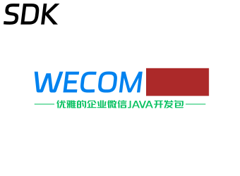

<div align="center" style="margin-bottom: 10px">
    <a target="_blank" href="https://mvnrepository.com/artifact/cn.felord/wecom-sdk">
     	
    </a>
</div>
<p align="center">
    <a target="_blank" href="https://github.com/NotFound403/wecom-sdk/blob/release/LICENSE">
     	
    </a>
    <a target="_blank" href="https://felord.cn">
     	
    </a>   
    <a target="_blank" href="https://spring.io">
     	
    </a>   
    <a target="_blank" href="https://mvnrepository.com/artifact/cn.felord/wecom-sdk">
     	
    </a>   
    <a target="_blank" href="https://github.com/NotFound403/wecom-sdk">
     	
    </a>    
    <a target="_blank" href="https://gitee.com/felord/wecom-sdk/stargazers">
     	
    </a>    
    <a target="_blank" href="https://work.weixin.qq.com/kfid/kfc9d9d759f27f087e1">
     	
    </a>    
    <a target="_blank" href="http://qm.qq.com/cgi-bin/qm/qr?_wv=1027&k=jteebwBcvUDnEIjP6Kef3HfucjoJtk3h&authKey=%2F6P%2FtQ6TOYDO1iRmtCcqNm4dMOXdqWHQ91cuNt9V3XtDy78orcy8cUlpOhwv3yCG&noverify=0&group_code=4390822">
     	
    </a>
</p>


<p align="center">如果你感觉这个项目不错，请点击右上角的Star以鼓励作者，谢谢。</p>

## 简介

wecom-sdk是开源的企业微信开放API的Java实现，历经三年迭代，目前已经实现了企业微信相关接口近200个，配置简单、API友好、开发人员不需要很高的学习成本就能快速接入企业微信。

## 特性

- 支持多企业微信同时配置作业
- 目前实现企业微信接口 200 多个，能满足大部分场景的需求
- 全参数封装，入参、出参高度语义化封装，再也不担心组织参数、解析参数的问题
- 实现统一回调，所有回调事件可集中异步处理，开发者只需要关心业务逻辑的处理
- 由 SDK 接管 AccessToken 生命周期，开发者无需关心 Token 的管理。

## 采用技术栈

- okhttp
- retrofit
- rxjava
- lombok
- jackson2
- xstream

## 使用方法

目前自建应用大部分功能可以适配，其它模式未适配。

## Maven中央仓库坐标

- 普通版本

```xml
<dependency>
  <groupId>cn.felord</groupId>
  <artifactId>wecom-sdk</artifactId>
  <version>1.0.14</version>
</dependency>
```

- retrofit rxjava 版本

```xml
<dependency>
  <groupId>cn.felord</groupId>
  <artifactId>rx-wecom-sdk</artifactId>
  <version>1.0.14</version>
</dependency>
```

## 入门

Spring Boot 例子参见项目的`samples/spring-boot-sample`。

### 例子

这里屏蔽了一些繁琐的步骤，开发者只需要做好配置即可调用。以下是调用企业群发API向客户群发送图文的例子：

```java
    //① 应用参数组装 建议持久化并使用缓存层
    AgentDetails externalAgent=DefaultAgent.nativeAgent("企业ID",
            "应用密钥",
            NativeAgent.EXTERNAL);
            //② 定义缓存 全局定义一次即可
            WeComTokenCacheable weComTokenCacheable=new Cache();
            //③ 初始化API入口，建议注入Spring IoC
            WorkWeChatApi wecom=new WorkWeChatApi(weComTokenCacheable);
            //④ 检索具体的API
            ExternalContactManager externalContactManager=wecom.externalContactManager(externalAgent);
            //⑤ 组织参数
            MsgTemplateRequest request=new MsgTemplateRequest(ChatType.GROUP);
            ContentText text=new ContentText("测试企业向客户群发送信息");
            request.setText(text);
            Link link=new Link();
            link.setTitle("百度一下");
            link.setDesc("遇到问题，百度一下");
            link.setUrl("https://www.baidu.com");
            link.setPicurl("https://www.baidu.com/img/pc_79b50cf376490.png");
            request.setAttachments(Collections.singletonList(new LinkMsgAttachment(link)));
            request.setSender("zhangsan");
            //⑥ 向企业微信服务器发起请求并获取响应结果
            MsgTemplateResponse msgTemplateResponse=externalContactManager.messageApi()
            .addMsgTemplate(request);
            Integer errcode=msgTemplateResponse.getErrcode();
            String errmsg=msgTemplateResponse.getErrmsg();
            String msgid=msgTemplateResponse.getMsgid();
            List<String> failList=msgTemplateResponse.getFailList();
```

步骤是不是非常简单，基本都是在组装参数。可能里面有几个概念大家会有疑惑，接下来我们对里面的一些重要概念进行一些说明。

### 实现缓存接口

需要实现标记缓存接口`cn.felord.WeComCacheable`的接口，分别用来存储**access_token**，**企业jsapi_ticket**，**应用jsapi_ticket
**
> 具体缓存策略根据企业微信文档自行实现。

### 应用抽象 AgentDetails

`cn.felord.AgentDetails` 是对应用的抽象描述，包含了企业ID`corpId`，应用ID`agentId`以及密钥`secret`
，绝大多数接口的调用会用到它，默认实现是`DefaultAgent`。如果是自建应用你可以这样初始化：

```java
AgentDetails agent=new DefaultAgent("企业ID","应用密钥","应用ID");
```

如果是内置应用，比如外部联系人应用：

```java
AgentDetails external=DefaultAgent.nativeAgent("企业ID","应用密钥",NativeAgent.EXTERNAL);
```

通常这些应用参数会存入数据库，然后我们需要通过**企业ID**和**应用ID**实现应用配置检索服务（可以增加缓存来降低数据库的检索压力）：

``` 
  (corpId,agentId)->AgentDetails
```

### 缓存中继

`WeComTokenCacheable`定义企业微信所需要的`AccessToken`、`corpticket`和`agentticket`中继缓存。这里我使用了Spring
Cache实现，你可以自由选择，但是要自行保证中继服务器数据一致性。

```java
public static class RedisWeComCacheable implements WeComTokenCacheable {
  private static final String QYWX_TOKEN_CACHE = "token::qywx";
  private static final String QYWX_CORP_TICKET_CACHE = "ticket::qywx::corp";
  private static final String QYWX_AGENT_TICKET_CACHE = "ticket::qywx::agent";

  @CachePut(value = {QYWX_TOKEN_CACHE}, key = "#corpId.concat('::').concat(#agentId)")
  @Override
  public String putAccessToken(@NotNull String corpId, @NotNull String agentId, @NotNull String accessToken) {
    return accessToken;
  }

  @Cacheable(value = {QYWX_TOKEN_CACHE}, key = "#corpId.concat('::').concat(#agentId)")
  @Override
  public String getAccessToken(@NotNull String corpId, @NotNull String agentId) {
    return null;
  }

  @CachePut(value = {QYWX_CORP_TICKET_CACHE}, key = "#corpId.concat('::').concat(#agentId)")
  @Override
  public String putCorpTicket(@NotNull String corpId, @NotNull String agentId, @NotNull String corpTicket) {
    return corpTicket;
  }

  @Cacheable(value = {QYWX_TOKEN_CACHE}, key = "#corpId.concat('::').concat(#agentId)")
  @Override
  public String getCorpTicket(@NotNull String corpId, @NotNull String agentId) {
    return null;
  }

  @CachePut(value = {QYWX_AGENT_TICKET_CACHE}, key = "#corpId.concat('::').concat(#agentId)")
  @Override
  public String putAgentTicket(@NotNull String corpId, @NotNull String agentId, @NotNull String agentTicket) {
    return agentTicket;
  }

  @Cacheable(value = {QYWX_TOKEN_CACHE}, key = "#corpId.concat('::').concat(#agentId)")
  @Override
  public String getAgentTicket(@NotNull String corpId, @NotNull String agentId) {
    return null;
  }
}
```

### API入口类

`WorkWeChatApi`是企业微信API的唯一入口，推荐注入**Spring IoC**
,然后就可以通过它的一系列方法来实现企业微信提供的功能了。例如通过手机号查询成员的企业微信userid:

```java
AgentDetails agent=DefaultAgent.nativeAgent("企业ID","通讯录secret",NativeAgent.CONTACT);

        GenericResponse<String> userIdByMobile=wecom.contactBookManager(agent)
        .userApi()
        .getUserIdByMobile("这里为手机号");
        String userId=userIdByMobile.getData();

```

### 回调

回调的处理通过`CallbackCrypto`来负责，它屏蔽了验签、解密、异步处理等技术难点，你可以通过`CallbackCryptoBuilder`
构建`CallbackCrypto`，并把`CallbackCrypto`注入Spring IoC。

#### CallbackCryptoBuilder

`CallbackCryptoBuilder`有几个关键点：

- `XmlReader`  XML解析的抽象，框架默认提供了XStream实现，不喜欢的可以重新实现注入。
- `Consumer<CallbackEventBody>` 消费事件函数，用来处理回调数据。
- `CallbackSettingsService` 企业微信回调配置检索，用来检索回调的配置参数。
- `ExecutorService` 回调处理线程池，回调数据的处理是异步的，这里默认提供了一个名字为`WECOM-CALLBACK-THREAD-POOL`
  的线程池，你也可以自定义一个符合你实际配置的线程池。

参考示例：

```java
@Bean
public CallbackCrypto callbackCrypto(IEventRecordService eventRecordService,
        IWeCallbackSettingsService callbackSettingsService){
        return new CallbackCryptoBuilder(eventRecordService::handleCallbackEvent)
        .build(callbackSettingsService::getByAgentIdAndCorpId);
        }
```

#### 回调示例

通用回调参考示例：

```java

@RestController
@RequestMapping("/wecom/callback")
public class CallbackController {
  /**
   * The Callback crypto.
   */
  @Autowired
  CallbackCrypto callbackCrypto;

  /**
   * 验证回调URL
   *
   * @param msgSignature the msg signature
   * @param timestamp    the timestamp
   * @param nonce        the nonce
   * @param echostr      the echostr
   * @param corpId       the corp id
   * @param agentId      the agent id
   * @return the long
   */
  @GetMapping("/{corpId}/{agentId}")
  public String verifyUrl(@RequestParam("msg_signature") String msgSignature,
                          @RequestParam String timestamp,
                          @RequestParam String nonce,
                          @RequestParam String echostr,
                          @PathVariable String corpId,
                          @PathVariable String agentId) {
    return callbackCrypto.decryptMsg(agentId, corpId, msgSignature, timestamp, nonce, echostr);
  }

  /**
   * 消费回调数据
   *
   * @param msgSignature the msg signature
   * @param timestamp    the timestamp
   * @param nonce        the nonce
   * @param xmlBody      the xml body
   * @param corpId       the corp id
   * @param agentId      the agent id
   * @return the string
   */
  @PostMapping("/{corpId}/{agentId}")
  public String consume(@RequestParam("msg_signature") String msgSignature,
                        @RequestParam String timestamp,
                        @RequestParam String nonce,
                        @RequestBody String xmlBody,
                        @PathVariable String corpId,
                        @PathVariable String agentId) {
    return callbackCrypto
            .accept(agentId,corpId,msgSignature, timestamp, nonce, xmlBody);
  }

}
```

> 目前暂时不支持第三方开发

## API实现进度

- 获取企业微信API域名IP段
  - [x] 获取企业微信API域名IP段
- 自建应用与第三方应用的对接
  - [x] 自建应用与第三方应用的对接
- 通讯录管理
  - [x] 成员管理
  - [x] 部门管理
  - [x] 标签管理
  - [x] 异步导入接口
  - [x] 通讯录回调通知
  - [x] 互联企业
- 客户联系
  - [x] 企业服务人员管理
  - [x] 客户管理
  - [x] 客户标签管理
  - [x] 在职继承
  - [x] 离职继承
  - [x] 客户群管理
  - [x] 联系我与客户入群方式
  - [x] 客户朋友圈
  - [x] 消息推送
  - [x] 统计管理
  - [x] 变更回调
  - [x] 管理商品图册
  - [x] 管理聊天敏感词
  - [x] 上传附件资源
- [x] 微信客服
  - [x] 客服账号管理
  - [x] 接待人员管理
  - [x] 会话分配与消息收发
- [x] 身份验证
- [x] 应用管理
- [x] 消息推送
- [x] 素材管理
  - [x] 上传临时素材
  - [x] 上传图片
- [x] OA
  - [x] 文档
  - [x] 日程
  - [x] 微盘
  - [x] 审批
- [x] 效率工具
- 企业支付
- 企业互联
- 会话内容存档
- 电子发票
- 家校沟通
- 家校应用
- 政民沟通
